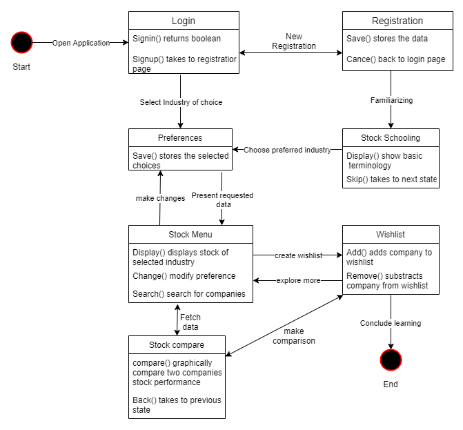
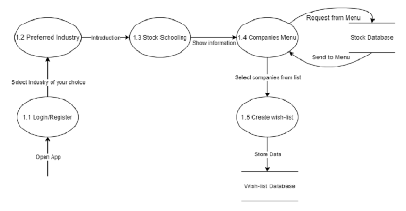

# stock_market_project

### HTML, CSS, Javascript, Firebase and Alpha Vantage API

Interestment is a project focused on the stock market in the financial domain. It aims to assist investors having a diversified portfolio with stocks from various global markets purchased using different demat accounts. The project is focused for users with zero to little stock market knowledge. The simple and minimal design aims to help users understand the working of the stock market, learn basic terms and understand the key metrics of different shares without the complex graphs and highly complex metrics.

# Website: https://interestment.web.app
# Android App (APK): 

The project has a LogIn / SignUp with the database connected to Firebase. It also has a FORGOT PASSWORD feature that sends an email to reset passoword to the registered email.
There are 5 sections in the project a user can interact with after logging in. These sections are as follows:

#### 1. Home: 
It has a dropdown menu that has different sectors like Banks, Sports etc. The goal is to group stocks for users based on their INTERESTS. 
#### 2. Search:
This page is used to search any GLOBAL stock and fetch their data from the last 5 days. A user can also add the stock to their watchlist.
#### 3. Watchlist
Users can view and edit their watchlist.
#### 4. Stock School
The aim of this section is to help the users get familiar with the terminology and basic questions about the stock market.
#### 5. Contact Us
For any quiries or requests, the user can contact us throught the given form.
#### 6. Editing
User can update their username and add more interests to their profile.

## Working of the project and data flow is as given below:

### State Chart Diagram

### Data Flow Diagram (DFD)

Level 0

Level 1

Level 2

# SRS Document and APK file can be found in this repository.
